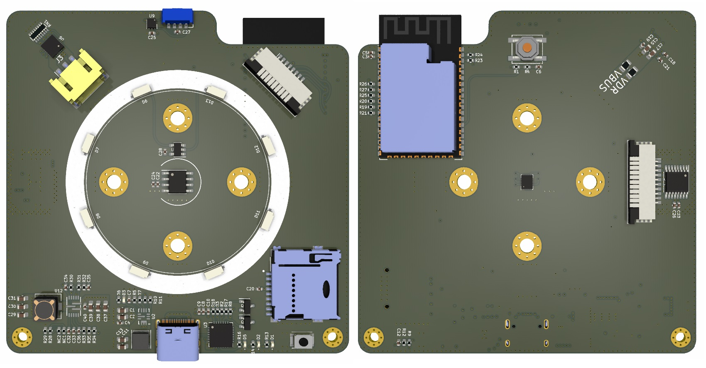

# ESP32-S2-WROVER 评估板 - SmartKnob
* 核心：ESP32-S2-WROVER 4N8R (4MB ROM,8M RAM)
* 串口：CP2102
* 电源：3.3V(MP2145),9V或可调(MP3431)
* 传感：光传感器VEML7700、温度传感器TMP117、6轴加速度传感器BMI160、磁编码器MT6701
* 外设：240x240 LCD串口屏幕(GC9401)、电容触摸屏(CST816)、SD卡、SK6812可编程LED、6PWM驱动器(TMC3600)、ADC(ADS122C04)
* 电机：BLDC-GM4018H

# 功能
* 智能旋钮，参考链接：https://www.youtube.com/watch?v=ip641WmY4pA

# 说明
### 工作模式介绍
* 旋转Knob，改变参数 (通过磁编码器检测)
* 按压Knob，模式切换 (通过SW1微动开关检测)
* Knob根据远程指令\传感器参数自动旋转 (通过控制电机转动)
### 器件功能
* VEML7700 提供环境光强度检测
* TMP117 提供室内温度检测
* BMI160 提供本设备姿态检测
* MT6701 检测电机精确旋转角度
* TMC3600 驱动BLDC电机，提供旋转反馈
* ADS122C04 24位低速高精度ADC，外接模拟信号传感器，如气体传感器、应变片
### 器件控制方式
* VEML7700、TMP117、BMI160、MT6701、ADS122C04、电容屏通过一个I2C总线控制
* LCD串口屏幕、SD卡通过一个SPI串口控制，其中LDC为非标准的四线SPI（CS、SLC、DC、SDA）
* GM4018H通过6线PWM控制

# 预览
