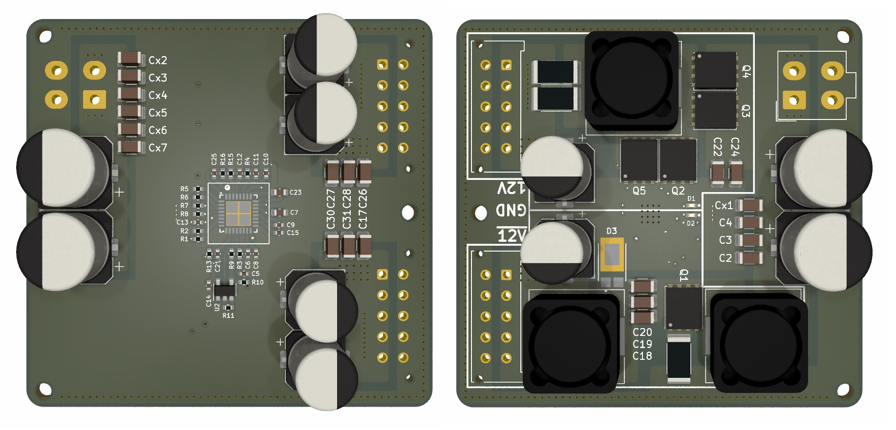

# 20V-55V 输入的 DCDC 双极性双轨开关电源
* 工作温度：0-85℃
* 16V-55V宽输（最低输入电压依赖于输出电压。最低输入电压＞设定输出电压+2V）
* 输出电压根据开关拓扑可调
* 默认设计-12V最大持续输出8A，12V最大持续输出8A (通过采样电阻配置)

# 注意事项

* 输出电流主要限制于电感和电容参数，在该原理设计中，理论最大输出可达-12V20A和12V60A。
* 要想获得更大的输出电流，需要更换饱和电流更大的电感或将多组FET-RC轨道并联

# 原理
见说明手册

# 接口
* 电源输入：Molex_5566_4.2mm_4P
* 电源输出：Molex_43045-1012

# 预览
