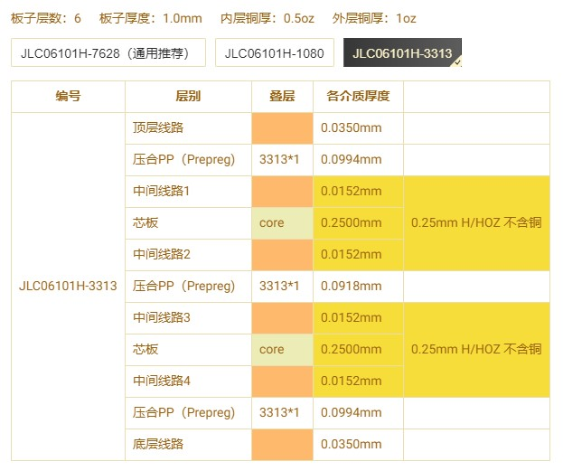
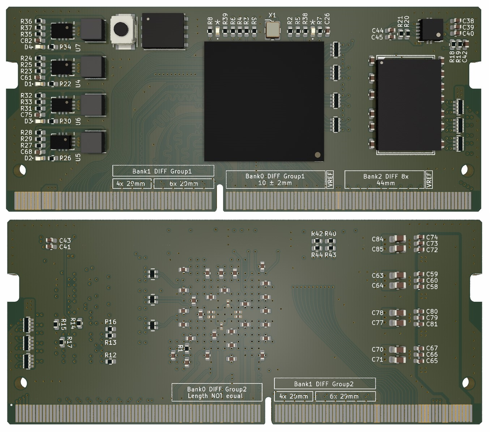

# XC6Slx25 核心板
* Bank0:全部差分引出(19组差分，一个Vref)
* Bank1:全部引出，部分差分(20组差分,14个自由引脚[包含Vref])
* Bank2:全部引出，部分差分(8组差分，一个Vref，,11个自由引脚)
* Bank3:连接DDR3
* DDR3-16位，差分100Ω、单端50Ω

# 高速信号注意
* 六层板，阻抗控制使用`3313压层`结构（详见压层参数）
* 500Mhz 信号建立时间350ps，信号到达误差20ps，允许线长误差 18mil)
* 100Mhz 信号建立时间2.5ns，信号到达误差300ps， (允许线长误差 240mil)

# 叠层

# 预览
